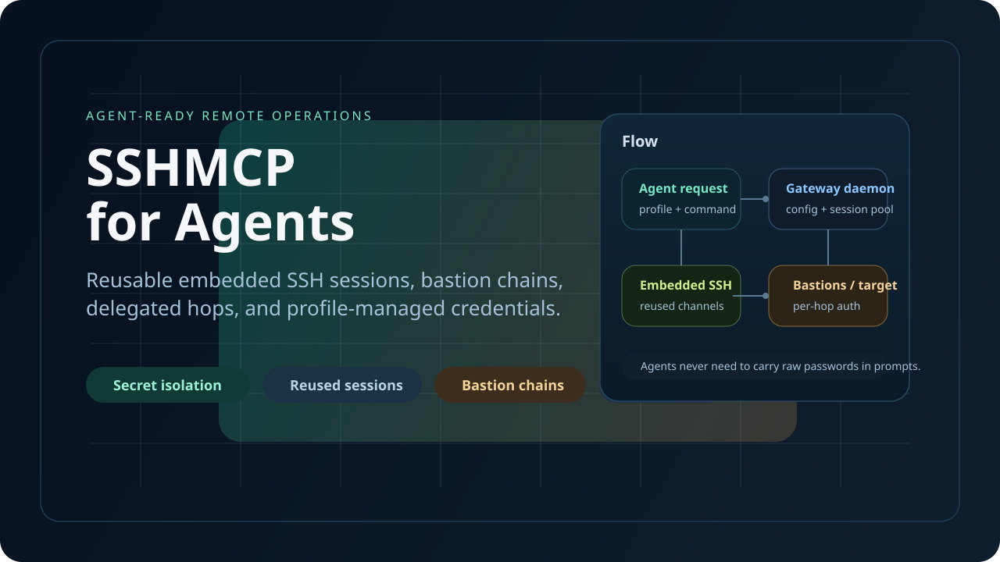
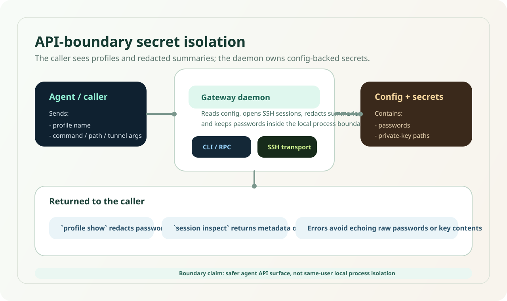
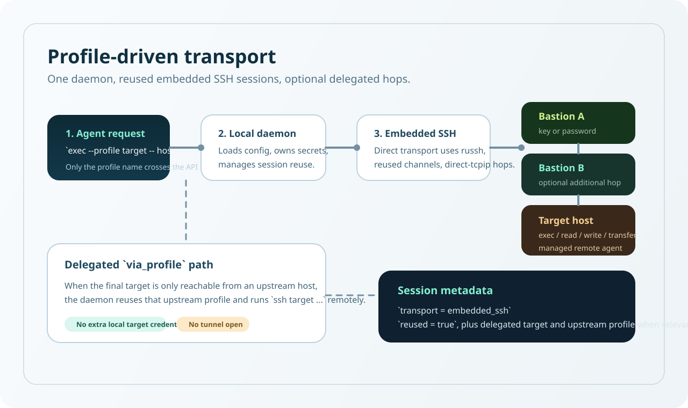

# SSHMCP

Secure remote access for AI agents.

Give agents capabilities, not SSH credentials.


Agent policy supports ordered `allow`, `confirm`, and `deny` rules. Confirmed operations persist in SQLite and execute once only through the Human CLI; MCP and `--agent` cannot approve. See [Human approval](docs/approval.md).

Rule-scoped task/time grants and hash-bound ordered Plans reduce repeated confirmations without allowing any authorization envelope to override `deny`.

<p align="center">
  <a href="README.zh-CN.md">简体中文</a>
</p>

<p align="center">
  
</p>

<p align="center">
  <a href="https://github.com/sshmcp/sshmcp/releases">
    
  </a>
  <a href="https://github.com/sshmcp/sshmcp/actions/workflows/release.yml">
    
  </a>
  <a href="LICENSE">
    
  </a>
  
</p>

SSHMCP is the open-source Core and self-hosted gateway. SSHMCP Cloud is a future hosted product. It provides reusable embedded SSH sessions, profile-based secret isolation, bastion routing, and policy-controlled remote operations for Codex, ChatGPT, Claude Code, Cursor, and custom agents.

It is intentionally **not** a general-purpose SSH client replacement. The project is optimized for agent workflows, profile-driven safety, and repeatable remote operations.

## How it works

```text
ChatGPT · Claude · Codex · Cursor · OpenCode · Custom Agents
                         | MCP
                         v
                      SSHMCP
       Identity · Policy · Human Approval · Audit
                  Session Management
                         | SSH
                         v
                    Your Servers
```

An agent becomes an authenticated Principal. Policy returns Allow, Confirm, or Deny. Confirmed requests require human approval; permitted execution is audited. This is not `LLM -> unrestricted ssh command`. OAuth identity and tenant-aware session isolation prepare the Core for a separate hosted control plane.

## Why SSHMCP

- Agents that repeatedly spawn one-shot `ssh` or `scp` often hit connection churn, login throttling, or refused sessions.
- Bastion chains, delegated hops, and mixed per-hop auth are awkward to express safely in prompts.
- Passwords and private keys should stay in gateway-owned config, not in agent-visible command lines or chat history.

## Features

- **Secret isolation at the gateway API boundary**: the daemon reads passwords, key paths, and optional key passphrases from config; callers send only `profile` plus operation arguments.
- **Redacted profile and session output**: `profile show`, `session inspect`, and error payloads never echo raw passwords or passphrases.
- **Profile-first agent workflow**: agents use named profiles instead of embedding secrets in `ssh` commands.
- **Controlled profile management**: MCP can inspect policy and, when explicitly enabled, request profile creation or deletion. Self-hosted mode uses MCP client confirmation; Cloud runtime mode requires Human CLI approval.
- **Embedded SSH transport with session reuse**: direct and bastion profiles use in-process SSH instead of spawning local `ssh.exe` or `scp`.
- **No local OpenSSH dependency for direct or bastion mode**: Windows and Linux direct transports run through the embedded client stack.
- **Per-hop auth for bastions and targets**: every hop can use its own password or key configuration.
- **Delegated `via_profile` mode**: reuse an upstream host's remote SSH capability when the final target is only reachable from that host.
- **Managed remote agent lifecycle**: version checks, bootstrap, and reuse happen on connect.
- **JSON-only CLI**: predictable automation surface for `daemon`, `profile`, `exec`, `read`, `write`, `upload`, `download`, `tunnel`, and `session`.
- **Two agent interfaces**: local agents use CLI + Skill; remote agents use the Streamable HTTP MCP server with static Bearer or OAuth JWT authentication.
- **OAuth resource routing for MCP**: external OIDC/JWT providers can route different audiences/resources to profile files and local file roots. Sessions are also isolated by authenticated subject and tenant identifier.
- **Agent Policy**: capability gates, exact command allowlists, and remotely resolved path restrictions apply to `--agent` CLI calls and every MCP call without changing legacy human CLI behavior.

## Security Model

### Runtime modes and host keys

Normal local installations use `self_hosted` mode. Existing YAML works without migration. For secure host key checking, set `runtime.host_key_mode: strict` and add an OpenSSH SHA256 fingerprint to the target and every bastion:

```yaml
runtime:
  mode: self_hosted
  host_key_mode: strict
profiles:
  - name: production
    target:
      host: server.example.com
      user: deploy
      host_key_sha256: "SHA256:replace-with-verified-fingerprint"
      auth: { type: key, key_path: ~/.ssh/id_ed25519 }
```

The default `insecure_compatibility` host key setting preserves old self-hosted behavior and accepts unpinned keys. It is insecure against SSH server impersonation. A configured pin is enforced even in this mode.

`runtime.mode: cloud` is a Cloud-ready core safety mode. It requires strict host keys, rejects SSH tunnels, blocks unsafe resolved network destinations, and requires IP literals for hops resolved by a bastion. It currently rejects delegated `via_profile` routes. It is not a hosted service. See [architecture](docs/architecture.md) and [security model](docs/security-model.md) for trust boundaries and current limits.

Authentication creates a `Principal` for each MCP or CLI caller. OAuth JWT `sub` identifies the caller; `mcp.tenants[].tenant_id` can identify the tenant separately from the resource audience. Sessions and authorization records use an internal namespace derived from that identity. The gateway resolves credentials behind its profile store boundary and emits redacted audit events through a replaceable sink.

<p align="center">
  
</p>

### What is isolated

- Passwords, private-key paths, and optional key passphrases live in `profiles.yaml`, `profiles.yml`, or legacy `profiles.toml`, and are consumed by the local gateway daemon.
- CLI and RPC requests carry `profile` names and operation arguments, not raw password, passphrase, or private-key values.
- `profile show`, `session inspect`, and error results redact secret material before returning JSON to the caller.

### What this is not

- This is **not** a claim of strong isolation against other local processes running under the same OS user.
- This is **not** a replacement for OS file permissions, secret managers, host hardening, or bastion policy.
- Delegated `via_profile` sessions still rely on the upstream host's own SSH capability to reach the final target.

### Operator guidance

- Keep live configs outside the repository.
- Restrict config file permissions to the expected local user or service account.
- Do not commit real profiles, passwords, or private keys.

## Quick Start

<p align="center">
  
</p>

```text
Local Agent -> Skill -> CLI -> daemon RPC --+
                                                +-> GatewayService -> SessionManager -> embedded SSH
Remote Agent ------------> MCP Server --------+
```

Profiles remain location-transparent: direct, bastion, and `via_profile` routing can change without changing Agent calls.

1. Download a release asset from [GitHub Releases](https://github.com/sshmcp/sshmcp/releases) and place `sshmcp` on your `PATH`.
2. Prepare a profile file. YAML is preferred; start from [examples/profiles.yaml](examples/profiles.yaml).
3. Validate the profile before the first run.
4. Start the daemon implicitly or explicitly and run remote operations by `profile`.

PowerShell:

```powershell
$env:SSHMCP_CONFIG_PATH = (Resolve-Path .\examples\profiles.yaml)
sshmcp profile validate
sshmcp daemon start
sshmcp exec --profile direct-with-bastion -- hostname
sshmcp session list
sshmcp daemon stop
```

Bash:

```bash
export SSHMCP_CONFIG_PATH="$PWD/examples/profiles.yaml"
sshmcp profile validate
sshmcp daemon start
sshmcp exec --profile direct-with-bastion -- hostname
sshmcp session list
sshmcp daemon stop
```

The config loader checks `SSHMCP_CONFIG_PATH`, then deprecated `SSH_GATEWAY_CONFIG_PATH` and `ARRT_CONFIG_PATH`. Without an override, it checks `profiles.yaml`, `profiles.yml`, and `profiles.toml` under the new SSHMCP config directory first, then the legacy directory. On Linux the new directory is `$XDG_CONFIG_HOME/sshmcp` (usually `~/.config/sshmcp`); on Windows it is `%APPDATA%\sshmcp\config`. Existing data under the legacy directory remains in use until a new SSHMCP data directory is created. Files are never moved automatically. See [migration guide](docs/migration-from-ssh-gateway.md).

## Config Examples

The repository keeps public-safe examples in [examples/profiles.yaml](examples/profiles.yaml).

### Direct SSH with a bastion

```yaml
profiles:
  - name: direct-with-bastion
    target:
      host: target.internal
      user: root
      port: 22
      auth:
        type: password
        password: target-password
    bastions:
      - host: bastion.example.com
        user: root
        port: 22
        auth:
          type: key
          key_path: ~/.ssh/id_ed25519

### Encrypted private key with a passphrase

```yaml
profiles:
  - name: encrypted-key-target
    target:
      host: secure.internal
      user: ops
      port: 22
      auth:
        type: key
        key_path: ~/.ssh/id_rsa_2048
        passphrase: local-key-passphrase
```

The passphrase is consumed only by the local gateway daemon. It is not returned by `profile show`, `session inspect`, or normal CLI error payloads.
```

### Delegated `via_profile`

```yaml
profiles:
  - name: upstream-bastion
    target:
      host: bastion.example.com
      user: root
      port: 22
      auth:
        type: key
        key_path: ~/.ssh/id_ed25519

  - name: delegated-target
    via_profile: upstream-bastion
    target:
      host: target.internal
      user: root
      port: 22
```

Delegated mode is useful when the upstream host already knows how to `ssh target.internal ...` and the local machine should not carry an additional target credential. In this mode:

- the delegated profile must not define `auth`
- the delegated profile must not define `bastions`
- `exec`, `read`, `write`, `upload`, and `download` are supported
- `tunnel open` is rejected for delegated sessions

### Legacy TOML

Legacy TOML remains supported for compatibility:

```toml
[[profiles]]
name = "legacy"

[profiles.target]
host = "target.internal"
user = "root"

[profiles.auth]
key_path = "~/.ssh/id_ed25519"
passphrase = "local-key-passphrase"
```

## Commands

Operational commands print JSON. Standard `--help` and `--version` output plain text.

| Area | Commands |
| --- | --- |
| `daemon` | `daemon start`, `daemon status`, `daemon stop` |
| `profile` | `profile list`, `profile show <name>`, `profile validate [name]` |
| remote ops | `exec`, `read`, `write`, `upload`, `download` |
| `tunnel` | `tunnel open --profile <name> --local <port> --remote <host:port>`, `tunnel close --id <tunnel-id>` |
| `session` | `session list`, `session inspect --id <session-id>`, `session close --id <session-id>` |
| `mcp` | `mcp serve [--listen 127.0.0.1:8765]` |
| combined service | `serve [--listen 127.0.0.1:8765]` |

Common examples:

```text
sshmcp exec --profile delegated-target -- hostname
sshmcp read --profile delegated-target --path /etc/hostname
sshmcp write --profile delegated-target --path /tmp/demo.txt --input hello
sshmcp upload --profile delegated-target --src ./local.txt --dst /tmp/local.txt
sshmcp download --profile delegated-target --src /tmp/local.txt --dst ./local-copy.txt
sshmcp tunnel open --profile direct-with-bastion --local 8080 --remote 127.0.0.1:11434
```

Local agents add `--agent`, for example `sshmcp exec --agent --profile aliyun -- docker ps`. See [Codex setup](docs/codex.md), [ChatGPT MCP setup](docs/chatgpt.md), and [NAS compose deployment](compose.yaml).

## MCP OAuth and multi-tenant configs

The MCP server keeps the existing static Bearer mode and also supports `oauth_jwt` for official OAuth-style MCP clients. In OAuth mode, `sshmcp` acts as a resource server: an external OIDC provider handles login and token issuance, while the gateway validates JWT signature, issuer, expiry, audience/resource, and required scopes.

```yaml
mcp:
  listen: 127.0.0.1:8765
  auth:
    type: oauth_jwt
    resource: https://gateway.example.com
    issuer: https://idp.example.com
    jwks_url: https://idp.example.com/.well-known/jwks.json
    scopes: [sshmcp]
  tenants:
    - resource: https://gateway.example.com
      config_path: tenants/main/profiles.yaml
      local_file_root: /srv/sshmcp/main/files
      profile_management:
        enabled: false
```

Each tenant entry points to its own `profiles.yaml`. The authenticated token audience selects the tenant, and the matching tenant controls visible profiles, Agent Policy, profile management, approvals, grants, local file transfers, and reusable SSH sessions. See [ChatGPT MCP setup](docs/chatgpt.md) for deployment details.

Relative local paths are resolved from the CLI caller's current working directory. This applies to `upload --src` and `download --dst`; the daemon rejects relative local paths at the RPC boundary and never resolves them from its own working directory. `.` and `..` in relative local paths are normalized before the request is sent. Windows drive-letter and UNC absolute paths are preserved.

Uploads create remote parent directories and overwrite an existing remote destination. Downloads create local parent directories and atomically replace an existing local destination only after the complete content has been received and synced. Transfer JSON includes the resolved path pair: `local_src`/`remote_dst` for uploads and `remote_src`/`local_dst` for downloads. Download results also include `overwritten`.

Under MSYS2, set `MSYS2_ARG_CONV_EXCL="*"` for transfer commands so MSYS2 does not rewrite remote POSIX paths before `sshmcp` receives them:

```bash
MSYS2_ARG_CONV_EXCL="*" sshmcp download --profile delegated-target --src /tmp/local.txt --dst ./local-copy.txt
```

`daemon stop` returns `{"status":"stopping"}` when it successfully signals a running daemon and `{"status":"not_running"}` when nothing is listening.

## Install from Releases

Release assets are published automatically for every pushed `v*` tag.

- Windows x64: `sshmcp-<version>-x86_64-pc-windows-msvc.zip`
- Linux x64: `sshmcp-<version>-x86_64-unknown-linux-gnu.tar.gz`
- Checksums: `SHA256SUMS`

Typical install flow:

1. Download the archive for your platform from [Releases](https://github.com/sshmcp/sshmcp/releases).
2. Extract `sshmcp` or `sshmcp.exe`.
3. Put the binary on your `PATH`.
4. Create a config file from [examples/profiles.yaml](examples/profiles.yaml).

For the bundled Windows skill installer, the default target path is `%LOCALAPPDATA%\sshmcp\bin\sshmcp.exe`. `skills/sshmcp/scripts/install.ps1` also persists that directory into the user `PATH` by default, so new shells can resolve `sshmcp` without an absolute path.

## Install as a Skill

The repository includes a portable `SKILL.md`-based skill at [skills/sshmcp](skills/sshmcp). The skill is meant for agents that support the open skills ecosystem and teaches them to prefer profile-driven `sshmcp` commands over raw `ssh`.

The skill can also bootstrap the `sshmcp` binary on first use by downloading the latest GitHub Release for the current platform. Agents should prefer `sshmcp` from `PATH`, then the installer's default target path, and only then reinstall.

### Open skills ecosystem

If your agent supports [`npx skills add`](https://github.com/vercel-labs/skills), prefer installing from the direct GitHub path to the skill directory. This avoids repository-root discovery ambiguity on agents or CLI versions that do not consistently resolve nested skills:

```bash
npx skills add https://github.com/sshmcp/sshmcp/tree/main/skills/sshmcp -g
```

Repository shorthand also works when the CLI discovers nested skills correctly:

```bash
npx skills add sshmcp/sshmcp --skill sshmcp -g
```

Examples for common agents:

```bash
npx skills add https://github.com/sshmcp/sshmcp/tree/main/skills/sshmcp -a codex -g
npx skills add https://github.com/sshmcp/sshmcp/tree/main/skills/sshmcp -a claude-code -g
npx skills add https://github.com/sshmcp/sshmcp/tree/main/skills/sshmcp -a cursor -g
```

To inspect what the CLI sees before installing:

```bash
npx skills add sshmcp/sshmcp --list
```

To update an existing install that originally came from `npx skills add`:

```bash
npx skills update sshmcp -g
```

`npx skills update` does not manage copies installed by the Codex-native `install-skill-from-github.py` script. If you previously installed the skill that way, remove the old copy and reinstall it through `npx skills add` if you want standard `skills` CLI updates later.

There is no mandatory central registry for installation. This repository is already a valid distribution source. [skills.sh](https://skills.sh/docs) is useful for discovery and the public leaderboard, but it is not required to install or update this skill.

### Codex-native installer

If you prefer the native Codex skill installer, the repository can also be installed directly from GitHub:

Windows PowerShell:

```powershell
py -3 "$env:USERPROFILE\.codex\skills\.system\skill-installer\scripts\install-skill-from-github.py" `
  --repo sshmcp/sshmcp `
  --path skills/sshmcp
```

Linux or macOS shell:

```bash
python ~/.codex/skills/.system/skill-installer/scripts/install-skill-from-github.py \
  --repo sshmcp/sshmcp \
  --path skills/sshmcp
```

Notes:

- Restart your agent after installing the skill.
- If `sshmcp` is missing, the bundled skill scripts can download the latest release binary on first use.
- The skill still expects a valid config file to already exist.
- The skill is intentionally thin: it does not replace the CLI, it standardizes how the agent should call it.
- Prefer `npx skills add` when you want a standard install/update workflow across agents.
- For passphrase-protected keys, keep the passphrase in the gateway config instead of pasting it into chat or shell flags.

## Release Workflow Overview

The repository ships a tag-driven GitHub Actions workflow at [.github/workflows/release.yml](.github/workflows/release.yml).

- Trigger: push a tag that matches `v*`
- Build matrix: Windows x64 and Linux x64
- Steps: checkout, install Rust stable, `cargo fmt --check`, `cargo clippy --all-targets --all-features -- -D warnings`, `cargo test --locked`, `cargo build --release --locked`, package artifacts, create GitHub Release, upload binaries plus `SHA256SUMS`
- Release notes: generated automatically by GitHub

Example:

```bash
git tag v0.2.0
git push origin v0.2.0
```

## License

Released under [Apache License 2.0](LICENSE).
