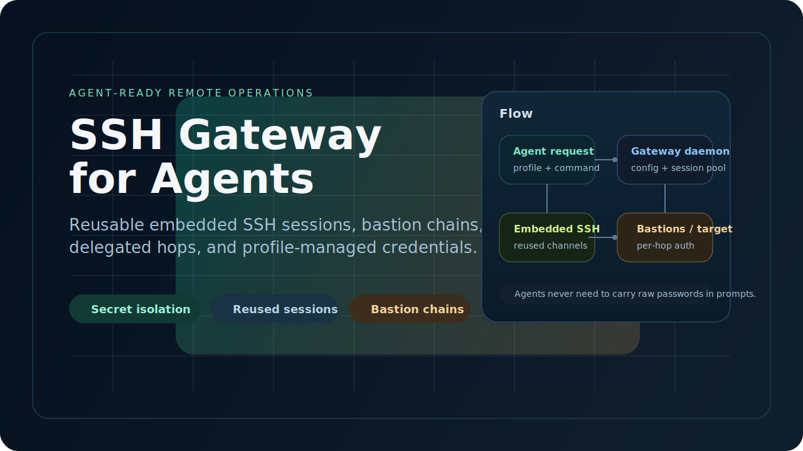
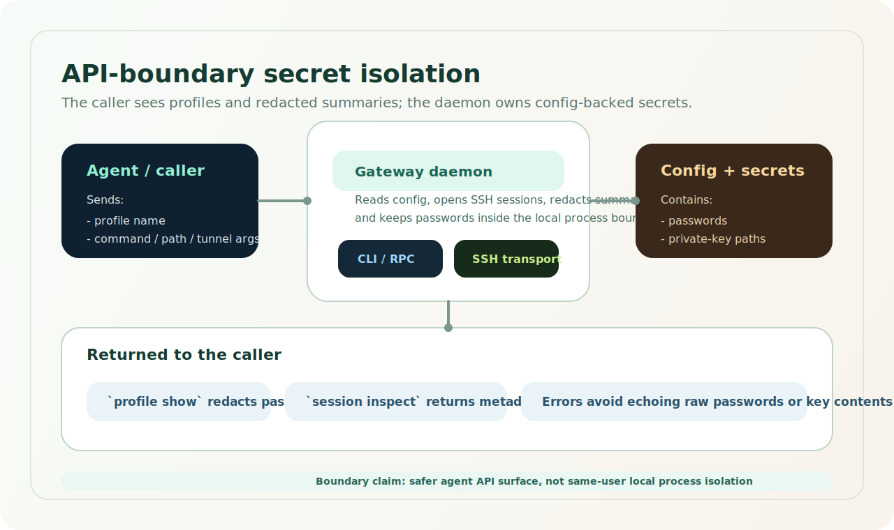
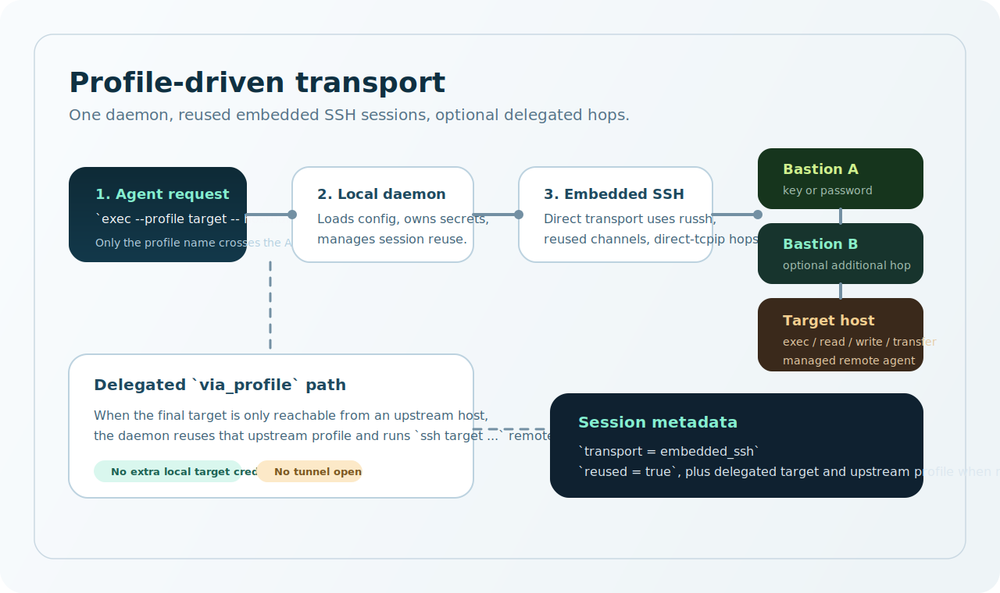

# ssh-gateway

<p align="center">
  <a href="README.md">English</a>
</p>

<p align="center">
  
</p>

<p align="center">
  <a href="https://github.com/TYzzt/ssh-gateway/releases">
    
  </a>
  <a href="https://github.com/TYzzt/ssh-gateway/actions/workflows/release.yml">
    
  </a>
  <a href="LICENSE">
    
  </a>
  
</p>

`ssh-gateway` 是一个面向智能体的 SSH 网关，适合在带跳板机的 Linux 环境里做远程自动化。它会在本地 daemon 中维护可复用的嵌入式 SSH 会话，把认证材料收敛到 gateway 自己管理的 profile 配置里，让 agent 通过 `profile` 名称操作远端，而不是直接暴露密码或私钥。

它刻意**不是**通用 SSH 客户端替代品；项目的重点是 agent 工作流、profile 驱动的安全边界，以及可重复的远程操作接口。

## 为什么需要 ssh-gateway

- 智能体如果频繁起一次性 `ssh` / `scp`，很容易把连接打碎，最终遇到节流、拒绝连接或登录失败。
- 带跳板机、多跳认证、委托登录这类链路，用 prompt 临时描述既脆弱又不安全。
- 密码和私钥应该留在 gateway 自己的配置和 daemon 边界里，而不是出现在 agent 可见的命令行或对话历史中。

## 特性

- **在 gateway API 边界做 secret isolation**：daemon 从配置文件读取密码、密钥路径和可选的私钥口令；调用方只传 `profile` 和操作参数。
- **脱敏的 profile / session 输出**：`profile show`、`session inspect`、错误结果都不会回显原始密码或口令。
- **面向 agent 的 profile-first 工作流**：agent 用 profile 名称工作，而不是拼带密码的 `ssh` 命令。
- **嵌入式 SSH + 会话复用**：direct / bastion 模式不依赖本地反复起 `ssh.exe` 或 `scp`。
- **direct / bastion 模式下本地不依赖 OpenSSH**：Windows 和 Linux 的直连传输都走内置 SSH 客户端栈。
- **逐跳认证**：target 和每个 bastion 都可以各自配置 password 或 key。
- **`via_profile` 委托模式**：当最终目标只能从上游主机访问时，复用上游主机已有的远端 SSH 能力。
- **托管远端 agent 生命周期**：连接时自动做版本检查、安装和复用。
- **JSON-only CLI**：统一覆盖 `daemon`、`profile`、`exec`、`read`、`write`、`upload`、`download`、`tunnel`、`session`。

## 安全模型

<p align="center">
  
</p>

### 已经隔离的部分

- 密码、私钥路径和可选的私钥口令保存在 `profiles.yaml`、`profiles.yml` 或兼容的 `profiles.toml` 中，由本地 gateway daemon 读取和使用。
- CLI / RPC 请求只携带 `profile` 名称和操作参数，不携带裸密码、口令或私钥内容。
- `profile show`、`session inspect` 和错误结果会在返回 JSON 之前做脱敏。

### 不是在承诺什么

- 这**不是**对“同一 OS 用户下其他恶意本地进程”的强隔离承诺。
- 这**不是**对操作系统权限、secret manager、主机加固或 bastion 策略的替代。
- `via_profile` 委托模式仍然依赖上游主机自身可用的 SSH 能力来打到最终 target。

### 运维建议

- 真正的配置文件放在仓库之外。
- 只给预期的本地用户或服务账号配置文件读取权限。
- 不要把线上 profile、密码或私钥提交到仓库。

## 快速开始

<p align="center">
  
</p>

1. 从 [GitHub Releases](https://github.com/TYzzt/ssh-gateway/releases) 下载二进制，并把 `ssh-gateway` 放进 `PATH`。
2. 准备 profile 配置。推荐 YAML，起点是 [examples/profiles.yaml](examples/profiles.yaml)。
3. 首次使用前先校验 profile。
4. 显式或隐式启动 daemon，然后通过 `profile` 执行远端操作。

PowerShell：

```powershell
$env:ARRT_CONFIG_PATH = (Resolve-Path .\examples\profiles.yaml)
ssh-gateway profile validate
ssh-gateway daemon start
ssh-gateway exec --profile direct-with-bastion -- hostname
ssh-gateway session list
ssh-gateway daemon stop
```

Bash：

```bash
export ARRT_CONFIG_PATH="$PWD/examples/profiles.yaml"
ssh-gateway profile validate
ssh-gateway daemon start
ssh-gateway exec --profile direct-with-bastion -- hostname
ssh-gateway session list
ssh-gateway daemon stop
```

配置加载优先级是 `ARRT_CONFIG_PATH` 优先；如果没设置，则默认查找：

- Windows：`%APPDATA%\opensource\ssh-gateway\profiles.yaml`，然后 `profiles.yml`，最后兼容 `profiles.toml`
- Linux：`$XDG_CONFIG_HOME/opensource/ssh-gateway/profiles.yaml`，然后 `profiles.yml`，最后兼容 `profiles.toml`

## 配置示例

仓库中的公开示例放在 [examples/profiles.yaml](examples/profiles.yaml)。

### 带 bastion 的 direct SSH

```yaml
profiles:
  - name: direct-with-bastion
    target:
      host: target.internal
      user: root
      port: 22
      auth:
        type: password
        password: target-password
    bastions:
      - host: bastion.example.com
        user: root
        port: 22
        auth:
          type: key
          key_path: ~/.ssh/id_ed25519

### 带口令的私钥

```yaml
profiles:
  - name: encrypted-key-target
    target:
      host: secure.internal
      user: ops
      port: 22
      auth:
        type: key
        key_path: ~/.ssh/id_rsa_2048
        passphrase: local-key-passphrase
```

这个口令只会被本地 gateway daemon 用来解密私钥，不会通过 `profile show`、`session inspect` 或普通 CLI 错误结果返回给调用方。
```

### 委托模式 `via_profile`

```yaml
profiles:
  - name: upstream-bastion
    target:
      host: bastion.example.com
      user: root
      port: 22
      auth:
        type: key
        key_path: ~/.ssh/id_ed25519

  - name: delegated-target
    via_profile: upstream-bastion
    target:
      host: target.internal
      user: root
      port: 22
```

如果上游主机已经知道如何执行 `ssh target.internal ...`，而本地机器又不应该额外持有 target 的凭据，就适合用委托模式。这个模式下：

- delegated profile 不能再定义 `auth`
- delegated profile 不能再定义 `bastions`
- 支持 `exec`、`read`、`write`、`upload`、`download`
- `tunnel open` 会被拒绝

### 兼容旧版 TOML

旧版 TOML 仍然支持：

```toml
[[profiles]]
name = "legacy"

[profiles.target]
host = "target.internal"
user = "root"

[profiles.auth]
key_path = "~/.ssh/id_ed25519"
passphrase = "local-key-passphrase"
```

## 命令

所有命令都输出 JSON。

| 范围 | 命令 |
| --- | --- |
| `daemon` | `daemon start`、`daemon status`、`daemon stop` |
| `profile` | `profile list`、`profile show <name>`、`profile validate [name]` |
| 远端操作 | `exec`、`read`、`write`、`upload`、`download` |
| `tunnel` | `tunnel open --profile <name> --local <port> --remote <host:port>`、`tunnel close --id <tunnel-id>` |
| `session` | `session list`、`session inspect --id <session-id>`、`session close --id <session-id>` |

常见示例：

```text
ssh-gateway exec --profile delegated-target -- hostname
ssh-gateway read --profile delegated-target --path /etc/hostname
ssh-gateway write --profile delegated-target --path /tmp/demo.txt --input hello
ssh-gateway upload --profile delegated-target --src ./local.txt --dst /tmp/local.txt
ssh-gateway download --profile delegated-target --src /tmp/local.txt --dst ./local-copy.txt
ssh-gateway tunnel open --profile direct-with-bastion --local 8080 --remote 127.0.0.1:11434
```

`daemon stop` 在成功通知一个正在运行的 daemon 时返回 `{"status":"stopping"}`；如果当前没有 daemon 在监听，则返回 `{"status":"not_running"}`。

## 从 Release 安装

每次推送 `v*` tag 都会自动发布 release 产物。

- Windows x64：`ssh-gateway-<version>-x86_64-pc-windows-msvc.zip`
- Linux x64：`ssh-gateway-<version>-x86_64-unknown-linux-gnu.tar.gz`
- 校验和：`SHA256SUMS`

典型安装步骤：

1. 从 [Releases](https://github.com/TYzzt/ssh-gateway/releases) 下载适合自己平台的压缩包。
2. 解压出 `ssh-gateway` 或 `ssh-gateway.exe`。
3. 把二进制放进 `PATH`。
4. 基于 [examples/profiles.yaml](examples/profiles.yaml) 准备配置文件。

## 作为 Skill 安装给智能体

仓库内置了一个可移植的 `SKILL.md` 风格 skill，目录在 [skills/ssh-gateway](skills/ssh-gateway)。它面向支持开放 skills 生态的智能体，职责不是替代 CLI，而是指导 agent 优先走 profile 驱动的 `ssh-gateway` 命令，而不是回退到原始 `ssh`。

这个 skill 还支持在首次使用时自动自举 `ssh-gateway` 二进制：如果本地没有 CLI，可以按当前平台从 GitHub Releases 下载最新版本。

### 开放 skills 生态安装

如果目标 agent 支持 [`npx skills add`](https://github.com/vercel-labs/skills)，更推荐直接指向 skill 目录对应的 GitHub 路径安装。这样可以避开部分 agent 或 CLI 版本在“从仓库根发现嵌套 skill”时的不稳定行为：

```bash
npx skills add https://github.com/TYzzt/ssh-gateway/tree/main/skills/ssh-gateway -g
```

如果 CLI 对嵌套 skill 的发现正常，仓库简写也可以用：

```bash
npx skills add TYzzt/ssh-gateway --skill ssh-gateway -g
```

常见 agent 示例：

```bash
npx skills add https://github.com/TYzzt/ssh-gateway/tree/main/skills/ssh-gateway -a codex -g
npx skills add https://github.com/TYzzt/ssh-gateway/tree/main/skills/ssh-gateway -a claude-code -g
npx skills add https://github.com/TYzzt/ssh-gateway/tree/main/skills/ssh-gateway -a cursor -g
```

如果你想先确认 CLI 实际看到了哪些 skill：

```bash
npx skills add TYzzt/ssh-gateway --list
```

如果这份 skill 最初就是通过 `npx skills add` 安装的，后续更新可以直接走：

```bash
npx skills update ssh-gateway -g
```

`npx skills update` 不会接管通过 Codex 原生 `install-skill-from-github.py` 装出来的副本。如果你之前是那条路径安装的，又想以后走标准的 `skills` CLI 更新流程，做法是先删掉旧副本，再改用 `npx skills add` 重新安装。

安装并不依赖某个强制的统一中心仓库。这个 GitHub 仓库本身就可以直接作为分发源；[skills.sh](https://skills.sh/docs) 更像发现入口和公开排行榜，而不是必须先注册才能安装的中心仓库。

### Codex 原生安装方式

如果你更想走 Codex 自带的 skill 安装器，也可以直接从 GitHub 安装：

Windows PowerShell：

```powershell
py -3 "$env:USERPROFILE\.codex\skills\.system\skill-installer\scripts\install-skill-from-github.py" `
  --repo TYzzt/ssh-gateway `
  --path skills/ssh-gateway
```

Linux / macOS shell：

```bash
python ~/.codex/skills/.system/skill-installer/scripts/install-skill-from-github.py \
  --repo TYzzt/ssh-gateway \
  --path skills/ssh-gateway
```

说明：

- 安装完成后需要重启对应的 agent。
- 如果本地还没有 `ssh-gateway`，skill 自带的脚本可以在首次使用时下载最新 release 二进制。
- 这个 skill 仍然预期本地已经有可用配置文件。
- skill 很薄，只负责规范 agent 应该如何调用本项目 CLI。
- 如果你希望跨 agent 统一安装和更新流程，优先用 `npx skills add`。
- 如果 profile 使用了带口令私钥，把口令留在 gateway 配置里，不要粘贴到对话或命令行参数里。

## Release 自动化概览

仓库自带一个 tag 驱动的 GitHub Actions workflow：[.github/workflows/release.yml](.github/workflows/release.yml)。

- 触发条件：推送匹配 `v*` 的 tag
- 构建矩阵：Windows x64 和 Linux x64
- 固定步骤：checkout、安装 Rust stable、`cargo test --locked`、`cargo build --release --locked`、打包产物、创建 GitHub Release、上传二进制和 `SHA256SUMS`
- Release Notes：交给 GitHub 自动生成

示例：

```bash
git tag v0.1.1
git push origin v0.1.1
```

## 许可证

项目采用 [Apache License 2.0](LICENSE)。
